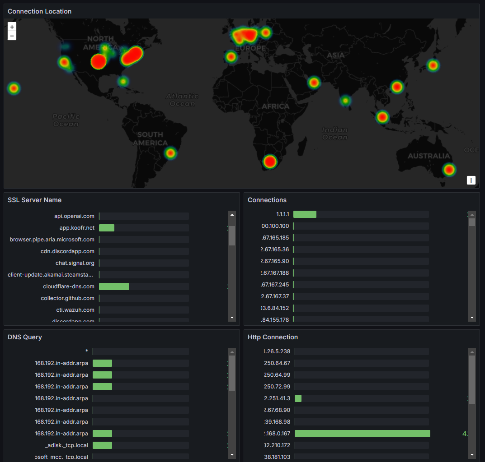
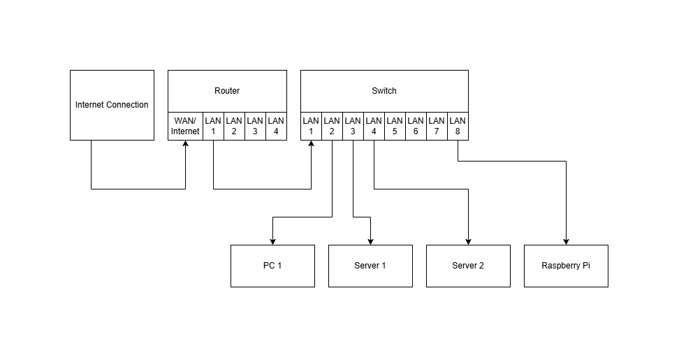

# zeek-grafana-loki
Monitor homelab network traffic packets with [Zeek](https://github.com/zeek/zeek) and visualize with [Grafana](https://github.com/grafana/grafana)

Screenshots:
--------------

Grafana Zeek Dashboard

Services
--------------
- [zeek](https://github.com/zeek/zeek)
- [grafana](https://github.com/grafana/grafana)
- [loki](https://github.com/grafana/loki)
- [alloy](https://github.com/grafana/alloy)

Requirements
--------------
- [docker compose](https://docs.docker.com/compose/)

Getting Started
--------------
`docker compose up`

Homelab monitoring
--------------
Running the application as mentioned in the Getting Started will monitor the host machine only, but to monitor all traffic in the network requires port mirroring on the routing level

Hardware Requirements:

- Managed Switch (Supported devices examples)

  - [Netgear GS308E](https://www.netgear.com/business/wired/switches/plus/gs308e/)

- Router
- Host machine, (Any device with lan port that can run docker, like Raspberrypi)

Network Diagram

Switch Setup:
- Enable port mirroring, and forward all ports to Raspberrypi LAN Port (LAN 8)

Machine Setup:

- Then run the applications inside the device following the Getting Started
